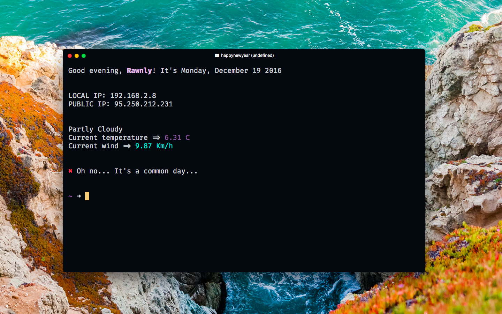
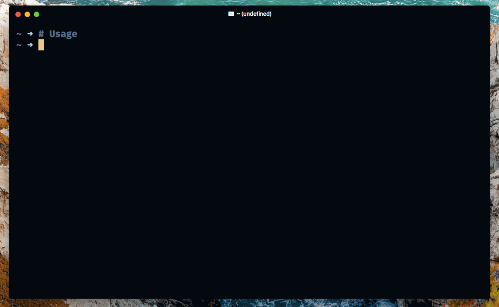

# HappyNewYear

**HappyNewYear** is a *nodeJs* client module who provides to check if in the current day is a [festivity](https://github.com/Rawnly/festivities.json).

<p align="center">
  
</p>

> Get the same setup  [here](https://github.com/Rawnly/dot-files)

> **Note**: Add it to your `.zshrc` or `.bashrc` to get the same result of the screenshot on top


## Installation
#### NPM
To install `happynewyear` you must use **npm** and install it as global.

```bash
  # Maybe needs sudo
  npm install -g happynewyear-cli
```
#### Clone
You can also clone this repo and install it manually,
```bash
  # Cloning
  git clone https://github.com/Rawnly/happynewyear.git

  # Installation
  cd happynewyear && npm test

  # If no errors
  npm intall -g
```

## Usage
Good! Then to check festivity simply digit `happynewyear` in your `shell`

<p align="center">
  
</p>

---
## All Festivities


